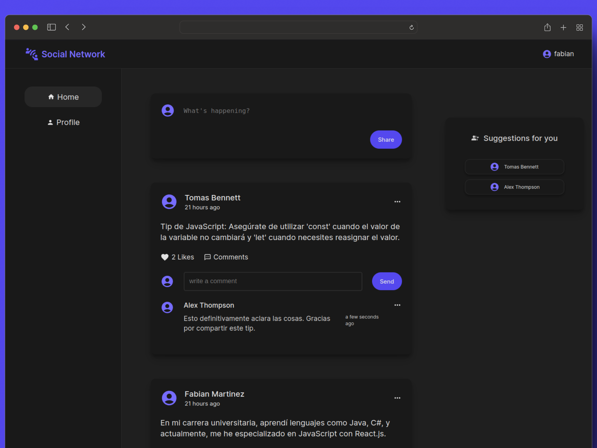

# 💫 About Me:

**University-level programmer** with a strong foundation in software development and self-learner. Willing to acquire new technologies and grow as part of a team. Creative, logical, and adept at problem-solving.  **Email:** FabianMartinezDev@gmail.com **Education:** University Technician in Programming - UTN (National Technological University)

# 💻 Highlighted Projects:

  
	
  
  
  

  

# 💻 Tech Stack:

                  

# 📊 GitHub Stats:
 
 

